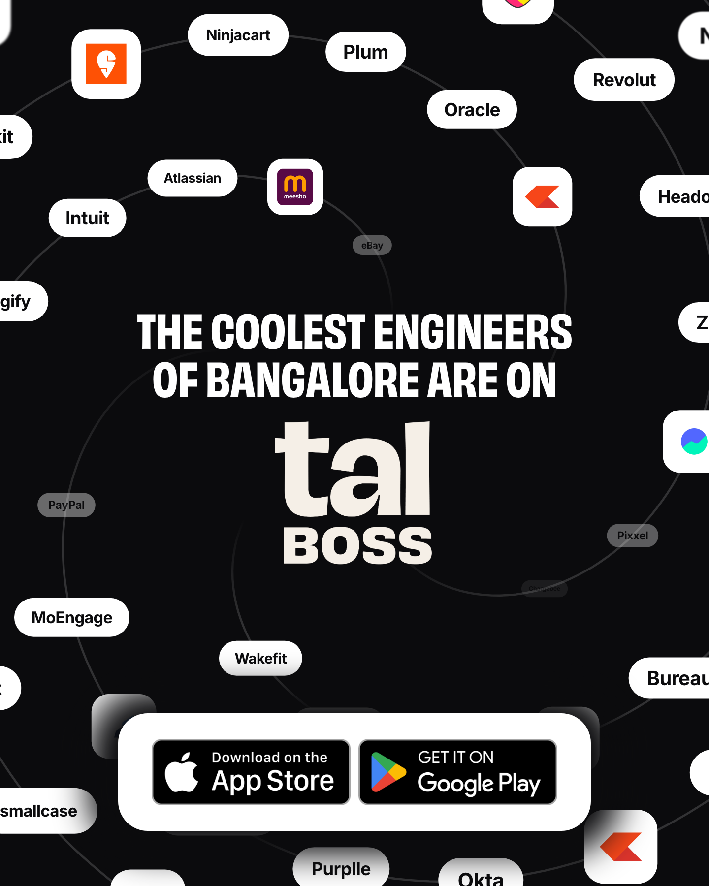

# tal BOSS - Gravity

The coolest people in Bangalore, falling into the mark.

One Remotion film, six cuts. The companies where Bangalore actually works
spiral inward and dissolve into the tal BOSS lockup. The message and the
download call to action never move.



## Quick start

```bash
npm install
# one-time: drop ObviouslyNarrowBold.otf into public/fonts/
# it is a licensed face and is not shipped with this repo.
# see public/fonts/README.md
npm run dev                  # Remotion Studio at localhost:3000
npm run render engineers     # mp4 + GIF + poster still into out/
```

## Making a new variation

Add an entry to `COHORTS` in [`src/cohorts.ts`](src/cohorts.ts). A composition
appears automatically. That is the whole workflow.

Read [`CLAUDE.md`](CLAUDE.md) first - it is short, and it lists the four things
that silently break a render (the display font is subset and has no apostrophe,
no `Math.random`, the loop has to stay periodic, frame zero has to stay still).

## Output

1080x1350 at 25fps, 12 second seamless loop, plus a 720x900 GIF and a
1440x1800 poster frame. Renders are versioned and never overwritten.
